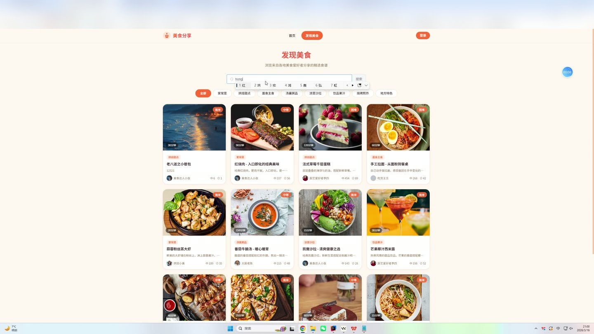
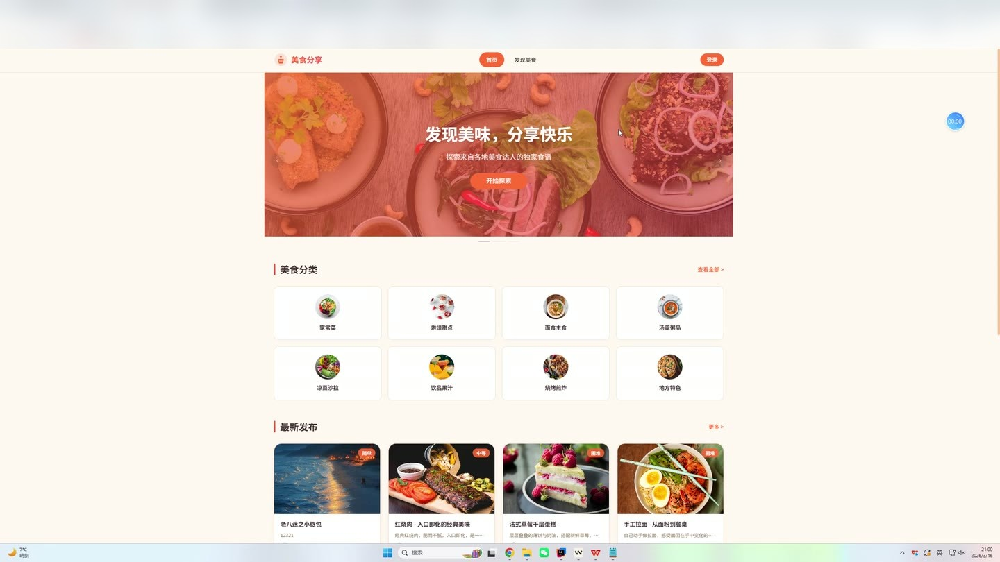
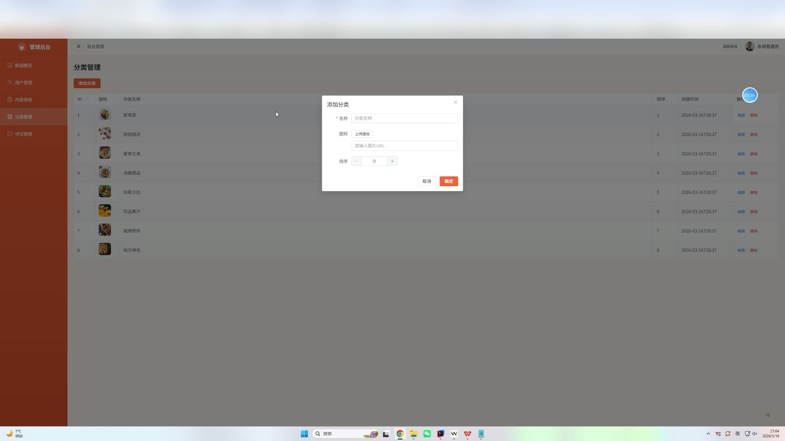
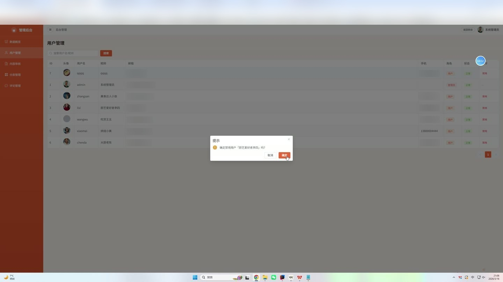

# (附文档)Springboot2+Vue3+MySQL 美食分享平台

**技术栈**：Springboot2、Vue3、MySQL

### 系统简介

本系统是一个基于 Spring Boot 2 + Vue 3 + MySQL 技术栈开发的前后端分离美食分享平台。系统包含普通用户端和管理员端两大角色，支持用户注册登录、美食帖子发布与管理、点赞收藏、评论互动、通知推送以及后台数据统计与审核等功能。
 
### 核心功能
 
### 普通用户端

 
- 用户注册：填写用户名、密码、昵称、邮箱完成账号注册，注册后自动跳转登录页 
- 用户登录：输入用户名和密码，校验通过后生成 JWT Token 并返回用户信息 
- 首页浏览：查看分类列表、最新美食帖子（8条）、热门帖子（按点赞数排序，6条） 
- 探索美食：按分类筛选、按标题/摘要关键词搜索美食帖子，支持分页浏览 
- 帖子详情：查看帖子完整内容、封面图、难度、烹饪时间、分步骤图文教程、作者信息 
- 发布美食：填写标题、封面图、摘要、正文内容、难度、烹饪时间、分类，并添加多步骤图文教程 
- 编辑帖子：修改已发布帖子的标题、封面、内容、步骤等字段，编辑后自动进入待审核状态 
- 删除帖子：删除自己发布的帖子，同时删除关联的步骤、点赞、收藏记录 
- 点赞帖子：对任意帖子点赞/取消点赞，点赞后实时更新帖子点赞数并通知作者 
- 收藏帖子：收藏/取消收藏帖子，收藏后实时更新帖子收藏数并通知作者 
- 我的帖子：分页查看自己发布的所有帖子列表 
- 我的收藏：分页查看自己收藏的所有帖子列表 
- 评论帖子：对帖子发表评论，支持回复他人评论（嵌套评论树结构） 
- 删除评论：删除自己的评论（管理员可删除任意评论） 
- 通知列表：查看系统通知（点赞、收藏、评论、审核结果），分页加载 
- 标记已读：一键将所有未读通知标记为已读 
- 未读计数：实时查看未读通知数量 
- 个人资料：查看和编辑昵称、头像、邮箱、手机号等个人信息 
- 修改密码：输入原密码和新密码，修改登录密码（MD5加密存储） 
- 智能推荐：基于协同过滤算法推荐可能感兴趣的美食帖子（根据点赞行为） 
- 文件上传：上传图片文件，返回可访问的 URL 地址用于封面、步骤图、头像等
 
### 管理员端

 
- 数据概览：统计平台用户总数、帖子总数、评论总数 
- 用户管理：分页查看用户列表（支持用户名/昵称关键词搜索），启用/禁用用户账号 
- 内容审核：查看所有帖子列表（支持按状态筛选和关键词搜索），审核通过/下架帖子 
- 评论管理：查看所有评论列表（支持内容关键词搜索），删除违规评论 
- 分类管理：添加美食分类（名称、图标、排序号），编辑分类信息，删除分类
 
### 技术栈

 后端框架Spring Boot 2.7.x ORMMyBatis-Plus 3.5.x 权限认证JWT (jjwt) + 自定义拦截器 前端框架Vue 3 (Composition API) + Vue Router 4 状态管理Pinia UI 组件库Element Plus 构建工具Vite 数据库MySQL 8.x 工具库Hutool (MD5加密)、Lombok
 
### 交付内容

 
- 后端完整源码 
- 前端完整源码 
- 数据库初始化脚本 
- 万字文档

## 界面展示

---

## 获取完整源码 + 万字文档

本仓库为项目介绍页。**完整前后端源码、数据库初始化脚本、万字项目文档**，请加微信 `kangkangcode`，或访问 [codekk.top](http://codekk.top) 获取。

可作课程设计 / 毕业设计参考，支持远程部署调试。